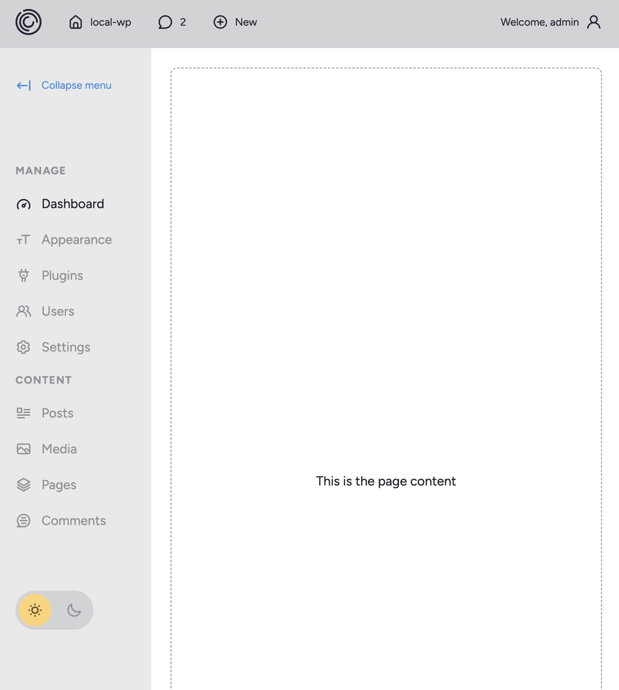

To install dependencies:
```sh
bun install
```

To run:
```sh
bun run dev
```

open http://localhost:4000


# Dashboard starter project



[css-starter](https://github.com/initialcapacity/css-starter)

[webdesign.tutsplus.com](https://webdesign.tutsplus.com/building-an-admin-dashboard-layout-with-css-and-a-touch-of-javascript--cms-33964t)
